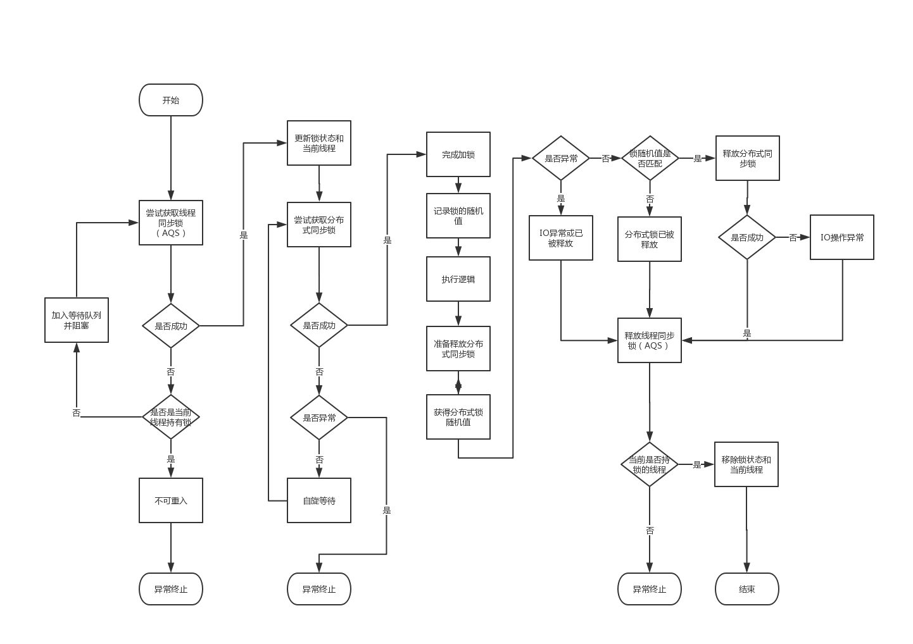

# dlock

一个轻量化的分布式锁实现

## 分布式锁的设计
dlock基于JUC的`Lock`接口来实现，锁逻辑主要分为两个部分：单个进程内部的多线程同步，以及不同进程之间的多线程同步

进程内的多线程同步使用`AbstractQueuedSynchronizer`来实现，保证在单个进程内，同时只有一个线程发起分布式加锁请求，避免多个线程同时进行自旋，消耗处理器性能

进程间的多线程同步将提供可扩展的设计，支持使用各种外部系统来提供分布式锁的支持，如Redis、数据库、Zookeeper等

### 不可重入的分布式锁执行过程



## 使用手册

目前提供的锁实现有如下几种：

- [RedisLock](#RedisLock)

### RedisLock

`RedisLock`是一个不可重入的分布式锁实现，使用时需要构造一个`RedisClient`来提供对Redis服务的访问。默认的实现有`JedisClient`。锁的使用方式很简单，与`Lock`接口一致：

```Java

JedisPool jedisPool = ...

RedisClient client = new JedisClient(jedisPool);
String lockName = "amazing:lock";
int defaultExpireSeconds = 5;

Lock lock = new RedisLock(client, lockName, defaultExpireSeconds);
lock.lock();
try {
  ...
} finally {
  lock.unlock();
}
```
